# MLCRough Visual Gallery

This gallery shows the output of the library across various shapes and complex examples. All these SVGs were generated using the `svgString` renderer in a DOM-independent environment.

## barchart.svg
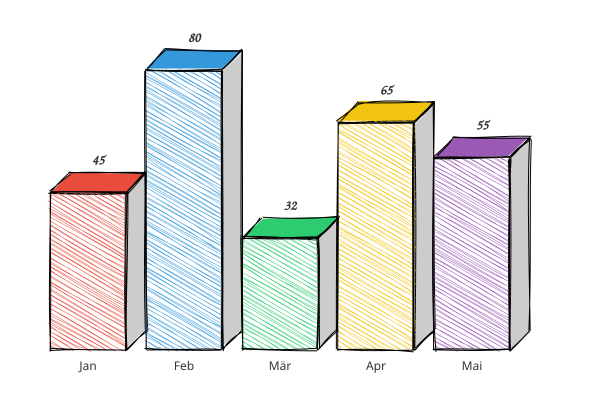

## circle.svg
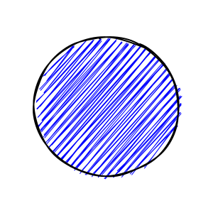

## dashed-ellipse.svg
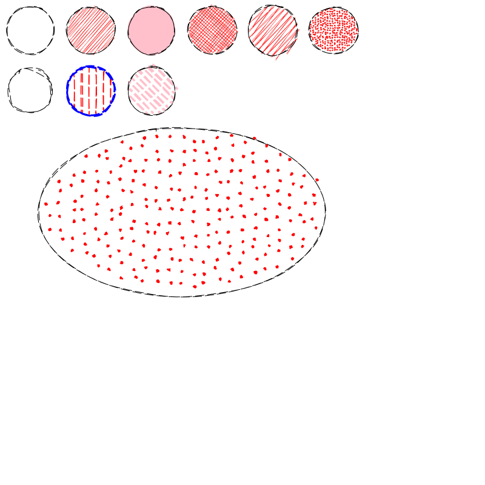

## dashed-line.svg
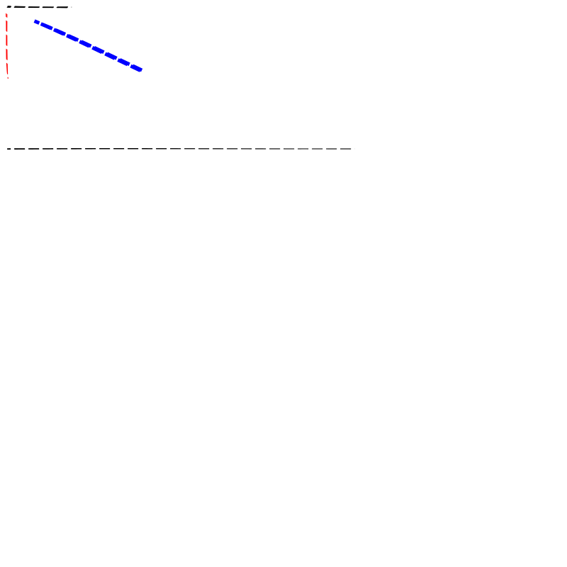

## dashed-polygon.svg
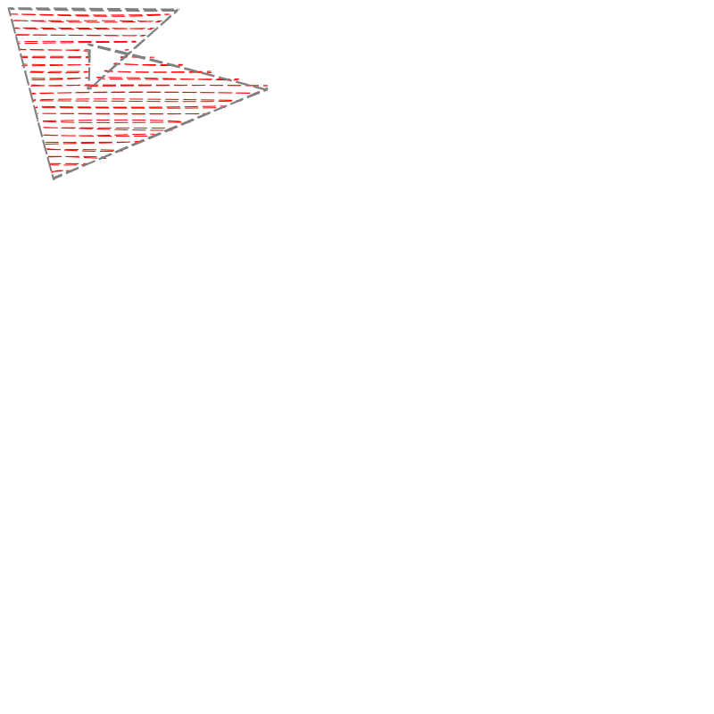

## dashed-rectangle.svg
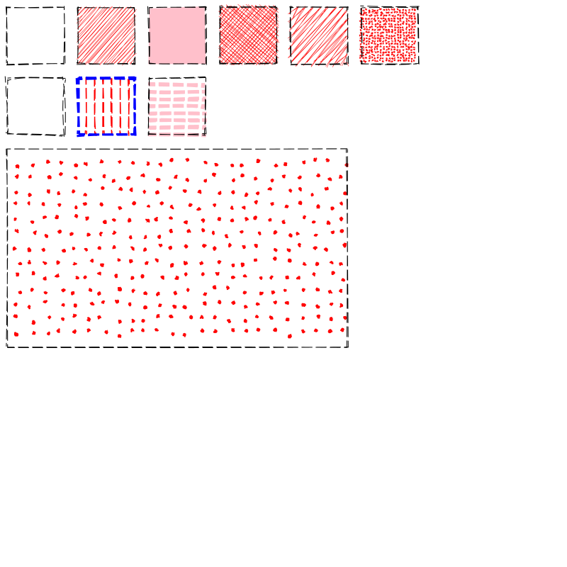

## ellipse.svg
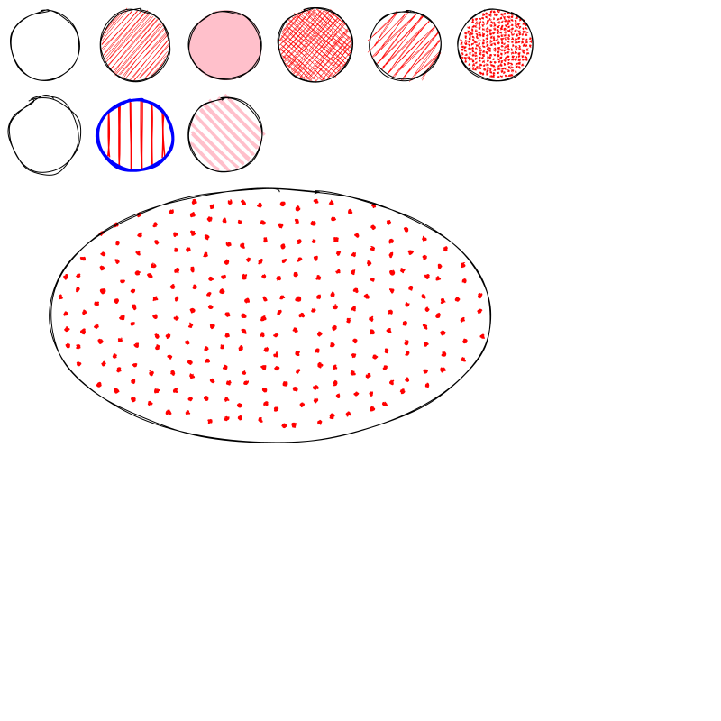

## gradient_fills.svg
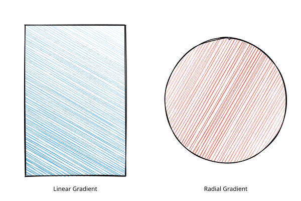

## line.svg
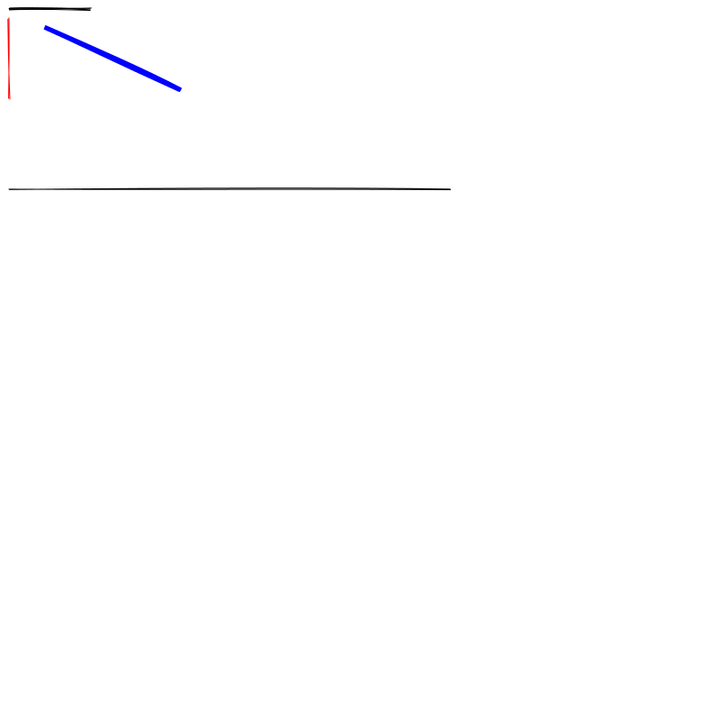

## multi_dot_fill.svg
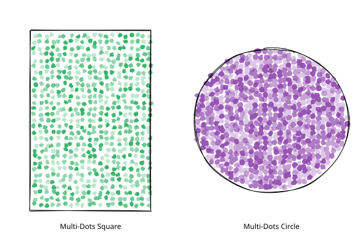

## multi_style_fill.svg
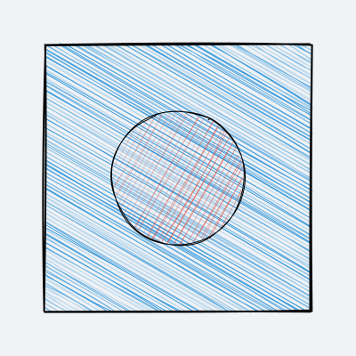

## piechart.svg
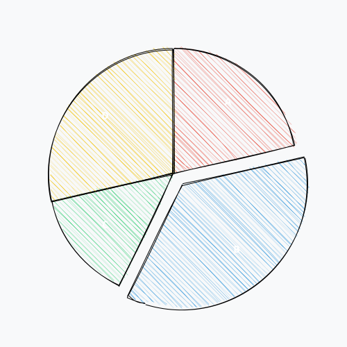

## piechart3d.svg
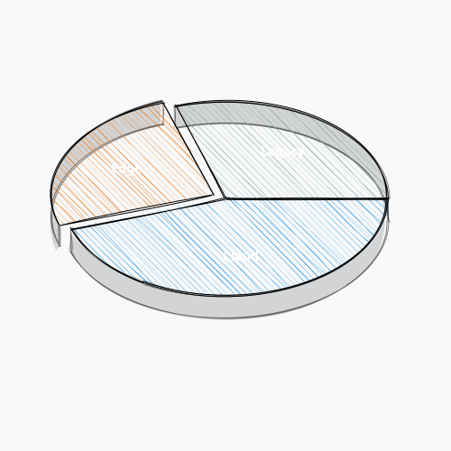

## piechart3d_advanced.svg
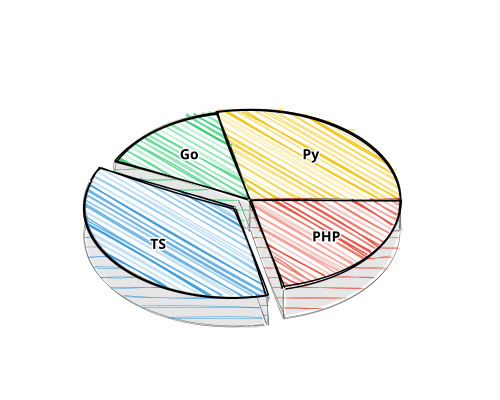

## polygon.svg
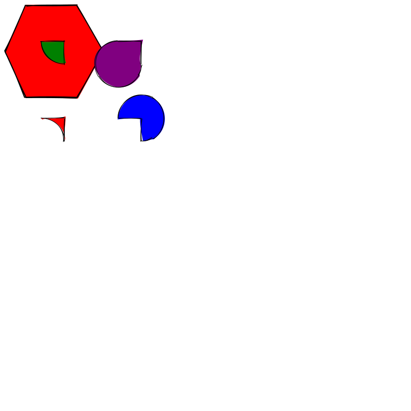

## rectangle.svg
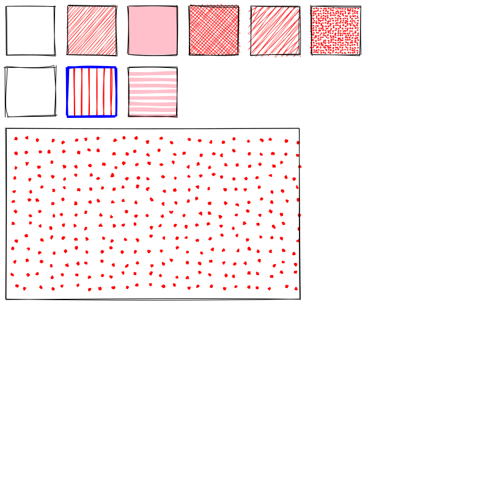

## rectangle2.svg
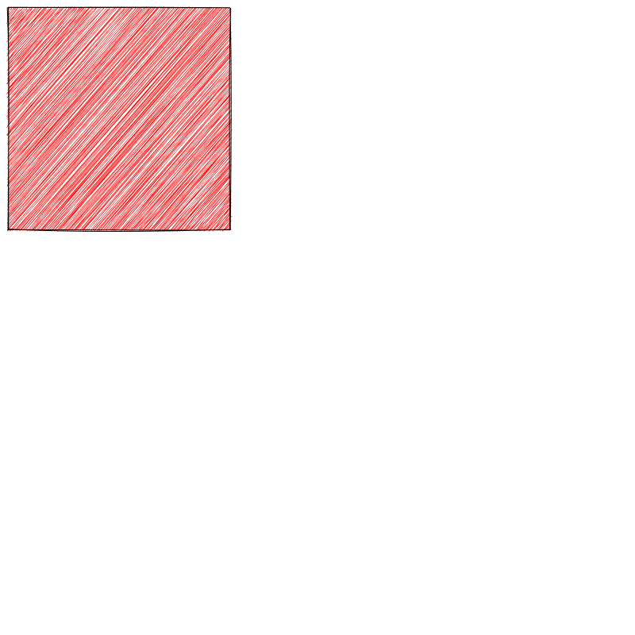

## ridgeplot.svg
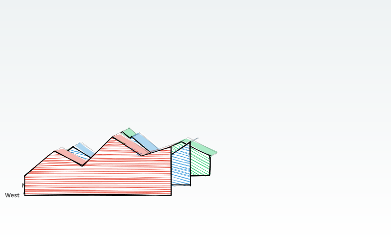